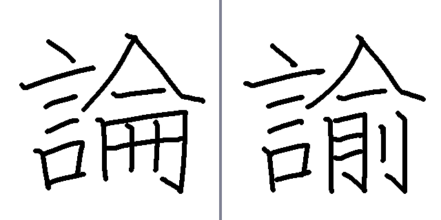
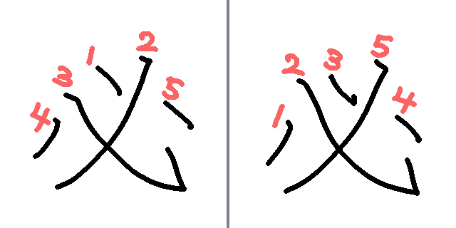
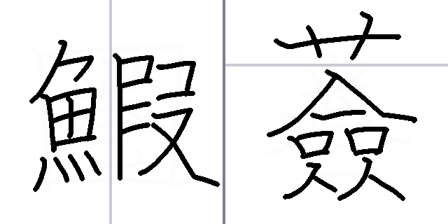

<!-- history:start -->
最終更新日…26/7/15

26/7/15
┗項目『その他』を更新

26/7/9
┗項目『お問い合わせ』を更新

26/7/8
┗項目『字形・認識』を更新

26/7/7
┗項目『トラブルシューティング』を更新

26/7/2
┣項目『モード』を更新
┗項目『字形・認識』を更新

26/6/30
┗項目『モード』を更新

26/6/29
項目『『ヘル改』『７ラッシュ』解放のために』を追加

26/6/28
┗項目『トラブルシューティング』を更新

26/6/25
┗項目『その他』を更新

26/6/24
┗項目『その他』を更新

26/6/21
┗項目『その他』を更新

26/6/11
┗項目『その他』を追加

26/6/9
┗公開
<!-- history:end -->
動作確認／推奨OSはWindowsのみです。Macなどほか環境は動作保証外です。
## リンク
|[Steam](https://store.steampowered.com/app/4826530/GOGO/)| |
|[『漢字でGO!』FAQ](https://formidi.github.io/KanzideGoFAQ/)| |
|[公式X](https://x.com/KanzideGo)| |
|[開発者X](https://x.com/t3n3bra3)| |


## モード

### 『ガチ』モードを解放したい
『エンタメ』モードのとあるコースを特定の条件でクリアすることで解放されます。
とあるコースの場合、条件に達していなくてもヒントが出現します。

### 『ヘル改』『７ラッシュ』以上の難易度、コースはある？
現状はございません。


## トラブルシューティング
### 『スマート アプリ コントロールがこのアプリの一部をブロックしました』と表示される
以下の方法で改善される可能性がございます。
- ゲームを一度アンインストールした後、インストールし直す
- スマート アプリ コントロールを『オン』以外のモードにする

### 『LiteRT推論器を読み込めませんでした。』と表示される
v0.0.20以降で場合、VC++ランタイムを導入すると改善される可能性がございます。
以下の手順をお試しいただけますと幸いです。

①Steamクライアントを再起動
②『漢字でGOGO!!』を右クリック
③プロパティ
④インストール済みファイル
⑤ゲームファイルの整合性を確認
⑥その後、Steamからゲームを起動

### ゲームが重い
録画／配信ソフトを同時に使っている場合は、『システム設定』>『画面設定』>『FPS』を設定いただくことで、ある程度負荷が軽減できます。  

### 音が鳴らない
ゲーム内の『音量設定』のほか、OS側の音量、使用中の出力デバイスを確認してください。  
タブがミュートになっていないかも確認してください。


## 問題・出典
### 問題『○○』のジャンルは『●●』とするべきでは？
大きな誤解を発生させるおそれのあるもの以外の修正／調整は行ないません。
また、誤解の多く生じている問題に関しては、予告なく別の形に問題文を変更する場合がございます。

### 別解はある？
問題によっては、表記ゆれや別字を別解として扱う場合があります。  
ただし、すべての異体字／旧字体／俗字に対応しているとは限りません。

### 辞書の『○○』という表記が別解にない
[古辞書や図鑑などの、すべての文献における別解が収録されているとは限りません。](https://kotowaza.jitenon.jp/kotowaza/1352.php)
初回プレイ時の『がっちり』設定や、カスタマイズの『Unicode表示』をご活用いただくことである程度別解を特定することができます。

### 別解があるかどうかは知りたいが、答えは知りたくない
カスタマイズの『Unicode暗号化』によって、Unicodeを暗号化することができます。

### 出典や収録レギュレーションが見たい
『漢字でGOGO!』においては、出典の一切を開示いたしません。

### 出典等を公開しないのはフェアではないのでは？
本作は検定試験や学術資料ではなく、漢字クイズゲームとして制作しているため、収録語／表記／読み／難易度などは、ゲーム内での出題バランスや遊びやすさも含めて独自に調整しています。

また、個別の出典や採用基準を詳細に公開すると、第三者資料の体系／配列／編集方針などとの関係が不必要に誤解される可能性があるため、公開範囲は慎重に制限しています。

その代わり、本作では問題チェッカー機能により、収録されている問題内容をゲーム内で確認できるようにしています。予習や確認をしたい場合は、そちらをご利用ください。

### でも『GO!』の方では開示してなかった？
『漢字でGO!』と『漢字でGOGO!』では、作品の公開形態や運用方針が異なるため、出典等に関する公開範囲も異なります。

『漢字でGO!』では、当時の公開形態や運用方針に基づき、収録内容について一定の説明を行っていました。しかし、その説明によってかえって誤解や混乱を招く場面もあったため、『漢字でGOGO!』では、個別の出典や採用基準を詳細に公開しない方針としています。

その一方で、『漢字でGOGO!』では収録内容の確認体制を見直し、辞書／書籍／公開情報などを実際に揃え、複数の資料を参照しながら用例等の確認をより慎重に行なっております。

表記／読み／解説内容に明らかな誤りがあると思われる場合は、具体的な問題を添えてお問い合わせください。


## 配信・動画投稿

### 配信しても大丈夫？
問題ございませんが、以下を遵守ください。

- タイトル、または概要欄などに、ゲーム名 『漢字でGOGO!』 を含めてください。
- 動画投稿／配信サイトが公式に提供している収益化機能を利用する場合に限り、収益化を許可します。
- 通常のゲームプレイ、実況、レビュー、感想、攻略、解説、切り抜きなどの投稿／配信は可能です。
  - ゲームの仕様上、視聴者が解答のネタバレをしやすい／されやすいです。概要欄やタイトルに答えやヒントに対する対応を記載されたり、モデレーターに管理してもらうことでトラブルが少なくなります。
- 『漢字でGOGO!』の動画投稿／配信を行なったことにより発生したいかなる損害／トラブルについても、制作者は一切の責任を負いません。
- 制作者は、誹謗中傷を含む動画、公序良俗に反する動画、本ガイドラインに従わない動画、その他不適切と判断した動画、配信、投稿に対して、削除申請や法的措置を含む対応を行なう権利を有します。

- 本ガイドラインの内容は、必要に応じて予告なく変更される場合があります。動画投稿／配信を行なう際は、最新のガイドラインをご確認ください。
- ゲーム内の映像／音声／画像などを、動画とは関係のない形で単独利用／販売／配布することは禁止します。

### ロゴがほしい
ロゴは以下をご自由にお使いください。

[漢字でGOGO!ロゴ](https://drive.google.com/file/d/1oes_lHoXFsVVatIGaJkq8Ns3_s8zGJ9U/view?usp=sharing)


## その他

### 起動時、左上に出るアイコンは何？
黄緑色の場合、全国正解率を受信しています。
正誤データに関してはカスタマイズで『全国正解率』をオフにした場合でもリザルト時に送信されるため、何卒ご了承ください。

### スマホアプリ版リリースの予定はある？
現状は未定です。

本作は、個人で無理なく管理できる運営規模を維持し、できる限り一人で継続的に開発／運営する方針です。
対応端末を増やすと、動作確認、不具合修正、お問い合わせ対応などの負担も大きくなるため、現時点ではSteam版のみを提供しています。

なお、Steam版の本作を起動できるPCがある場合は『[Steam Link](https://apps.apple.com/jp/app/steam-link/id1246969117)』のリモートプレイ機能を利用することで、疑似的にではありますがスマートフォンやタブレットからプレイすることもできます。
ただし、PCがBluetoothに対応している必要があります。

### 『ガチ』『ラッシュ』などだとヒントの円が小さい気がする
『エンタメ』に限り、ヒント使用時の円形マスクの大きさに1.4倍ほどの補正が掛かっています。

### 正解時フォントで明らかに対応していないグリフ(字)がある。どうやって出している？
一部漢字は『Klee One』『Noto Sans JP』では表示できないため、Micelleが文字パーツをつなぎ合わせて無理やり作っています。
（フォント自体の改変ではなく、画像として読み込ませています）

### 初回プレイ時のムービーを飛ばせるようにしてほしい
ムービーには、本作を遊ぶうえで重要な説明や注意事項が含まれています。  
そのため、初回のみスキップできない仕様としています。

また、セーブデータの削除、別アカウントでのプレイ、端末変更などにより再度表示される場合がありますが、ムービー自体は約2分程度です。  
お手数をおかけしますが、内容をご確認のうえプレイしていただけますと幸いです。

### 他のクイズゲームで、漢字でGO!系列を出典にしていると思われる問題を見かけた。漢字でGO!の問題はすべて詳しく調べている？
すべての問題について『絶対に正しい』と保証するものではありません。誤字、誤用、解釈の違い、資料による表記ゆれなどが含まれる可能性はあります。
ただし、他のゲームやサービスに投稿された問題の内容／正誤／主張につきましては、本ゲーム側が責任を負うものではありません。

その問題が漢字でGO!系列から引用されたものかどうかは、該当する投稿内容と漢字でGO!系列の問題文を照合して判断されるべきものです。

また、できるだけ誤解を無くすために、漢字でGO!系列の問題文／解説文／構成を、別のクイズゲームやレベルエディット機能を持つゲーム等にそのまま、または一部改変して投稿する行為はお控えください。


## 『ヘル改』『７ラッシュ』解放のために
この二つの解放条件は意図的にとても難しくしています。[Micelle自身がマウスで達成できる程度のバランス](https://x.com/t3n3bra3/status/2068380331150098455)です。
（開発者自身が紹介することは本末転倒な気はいたしますが）理不尽に感じるプレイヤーへ誤解を減らすために、ここでは攻略の方法を記述する所存です。

```
【追記】
v0.0.81より、10問コースでも解放できるようにいたしました。
v0.0.60より、ギリギリの制限時間を4秒延長(16秒⇒20秒)しました。
```

### マウスで画数の多い字が書ける気がしない…
以下の可能性がございます。これら改善することで書きやすくなる可能性がございます。

- マウス感度が極端に低い or 高い
- センサーに埃などが入っている
- マウスが接地している面がデコボコしていたり、摩擦が大きい
  - 平らで、滑らかにマウスを動かせる環境が望ましいです。
- 問題を見てから書くまでが長い
  - 解放には、問題が出てすぐに書き始める程度の[地力](https://www.kanjipedia.jp/kotoba/0004662300)が必要です。正答率の低い難問に逢着する場合もございますが、地力があれば突破できるはずです。
- 二回以上試行するために、焦って早く書き過ぎている
  - ある程度慣れてきたら、時間いっぱいまで使って一発で解答することを強く推奨いたします。
- 『きびしめ』以上でプレイしている
  - 判定は解放条件に関係ないため、単に解放したいことが目的であれば『ふつう』以下を推奨いたします。

### 『ウッチョウ』『トウテツ』『ツツジ』などは無理では？
マウスで間に合うことを確認しております。(映像はv0.0.50以前)
[video:movies/Movie_Hell_001.mp4]

### マウスは何を使ってる？
[Amazonの800円程度のマウス](https://amzn.asia/d/0db0Ur0R)です。

### 画数の多い字は、初見だと対応できないのでは？
問題チェッカーから、ガチを解放していれば該当レベルの問題を確認することができます。（７は除く）

### すべての問題を初見で挑みたいけど、理不尽な問題はやりたくない
難読漢字を勉強できるサイトで予習／対策をすることで、『理不尽な問題』の範囲を狭めることができます。

### お祈りゲーすぎる。解放条件を緩和してほしい
解放条件については、運に左右される場面を減らすため、ヒントを駆け引きとして1度使用できるようにしたほか、制限時間の延長や、10問コースでも達成可能にするなど、リリース当初から複数回の緩和を行なっています。

一方で、条件をこれ以上大幅に緩和しないのは、ゲーム外の情報を参照しながら解答するなど、本来想定していない方法で容易に突破できる状態を防ぐためです。

前作では、タブの切り替えなどによって制限時間を意図的に止め、解放条件を突破する方法が一部で利用されていました。
個人でそのように遊ぶこと自体を問題視するものではありませんが、その手法が配信などで公言／共有され、配信者に本来想定していない高難易度コンテンツへの挑戦を促し、困惑させる事例もございました。

そのため、本作では解放条件の公平性や、配信を含むプレイ環境への影響を考慮し、外部情報の参照による突破には慎重な対策を行なっています。何卒ご理解いただけますと幸いです。


## 字形・認識
精度の目安は、おおむね『ほかの人が漢字を見た時、文脈などで大体わかる程度』と思っていただければ幸いです。

### どうやって漢字を認識させている？
[CaptainDario](https://github.com/dariyooo)様の『Dakanji』という機械学習モデルを使用しております。
JIS第3水準以降、および水準外の漢字においては、Micelleが数回漢字を書いてサンプルを集め、平均して頻出するものをその字として見なす設計にしております。
（エンジン自体の改変ではなく、ゲーム上のシステムによるものです）

### 正しく書いたはずなのに、特定の漢字がうまく認識されない
可能であれば[ペンタブレット](https://ja.wikipedia.org/wiki/%E3%83%9A%E3%83%B3%E3%82%BF%E3%83%96%E3%83%AC%E3%83%83%E3%83%88)類でのプレイを推奨いたします。

画数の少ない字ほど丁寧に書く必要がございます。

判定『やさしめ』でも誤答扱いになる場合は、以下の書き方をされている可能性がございます。
- 文字が小さすぎる
  - 文字を大きくするほど判定の精度が向上します。
- 早く書こうとして、楷書ではつながらない部分をつなげたり、崩しすぎている
  - 『別の字を崩したもの』だと認識されるリスクが高まります。
- 本来離す部分がくっついてる
  - 画数の少ない字の場合は特に認識しづらくなります。
- 楷書では角ばる部分を丸く曲げて書いている
- 文字を傾けすぎている

### 『へん』や『つくり』が違っているのに正解してしまうことが気になる
認識エンジンにおける仕様です。
例えば『椀』を『捥』と書くなど、特にJIS第1・2水準外の文字（サンプル外）が出てくると弱く、それに近似した文字を探して候補を返すので、『椀』が返ってきやすいです。
こちらは仕様上免れないものであるため、何卒ご了承くださいませ。

### 【DaKanjiがニガテな部分】
- パーツの字形が似通ったもの
  - 『令』の下部分が『マ』のものも解答と見なせるため、メリットにつながる部分もございます。


- 著しく字形を崩したもの
  - DaKanjiは『書かれた字と近いもの』を探そうとします。
  - 崩し字は非推奨です。


- 標準字体を書き違えたもの
  - 同上
  - 誤字の場合はそれと近い字を探すため、おおむね合っていれば通ります。


- 一部パーツが欠損しているもの
  - 判定の設定が広いほど通るようになります。
  - ゲーム側に導入している『特定の字が先行していた場合に弾く』機能で幾分か改善が見込めますが、すべての字に対して考慮しなければならなかったり、判定が想定以上に厳しくなるおそれがございます。


### 【DaKanjiが得意な部分】
- 書き順が複数あるもの


- マス目の分割認識
  - 一部問題対応。精度が上がるほか、JIS第3水準以降も対応できます。


### 『へん』や『つくり』をグチャグチャっと書いても正解してしまうことが気になる
プレイヤーの良心に委ねられる部分ですので、ご容赦頂ければ幸いです。


## お問い合わせ
荒らし行為が散見されるため、スマートフォンによる投稿を制限しております。

### 不具合を報告する時は何を書けばいい？
次の情報があると確認しやすくなります。
- 遊んでいるバージョン
- 使用しているOS／端末名
- 発生したモードや問題ID
- 何をした時に起きたか

### お問い合わせフォーム

[漢字でGOGO!お問い合わせフォーム](https://ssl.form-mailer.jp/fms/6226591e884248)